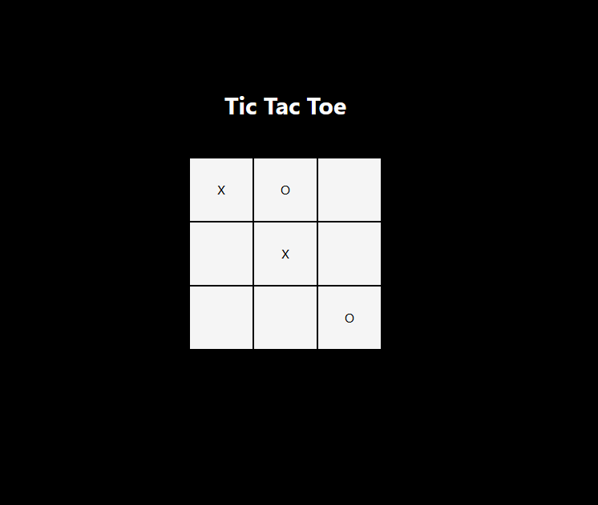

# Tic Tac Toe 🎮

A simple **Tic Tac Toe** game built with **React** and styled using **Tailwind CSS**.



---

## 🚀 Features
- Classic 3x3 Tic Tac Toe gameplay
- Interactive board with clickable squares
- Winner detection (X or O)
- Styled using Tailwind CSS utility classes
- Responsive and centered layout

---

## 🛠️ Tech Stack
- [React](https://reactjs.org/)
- [Tailwind CSS](https://tailwindcss.com/)

---

## 📦 Installation & Setup

Clone the repository and install dependencies:

```bash
git clone https://github.com/ritaCosta93/react-tic-tac-toe.git
cd tic-tac-toe
npm install
